# Merhaba, ben Berfin 👋

Balıkesir Üniversitesi Bilgisayar Mühendisliği 4. sınıf öğrencisiyim. Yapay zeka ve makine öğrenmesine ilgi duyuyorum.

- 🌱 Derin öğrenme ve diffusion modelleri üzerine çalışıyor, model eğitimi ve deployment süreçlerini öğreniyorum.
- 📫 Bana ulaşmak isterseniz profildeki iletişim bilgilerinden yazabilirsiniz.

## 🛠️ Diller & Teknolojiler

## 🤖 ML / DL Kütüphaneleri

## 🧰 Araçlar

## 📊 GitHub İstatistikleri

## 🧠 Forward Pass

---
